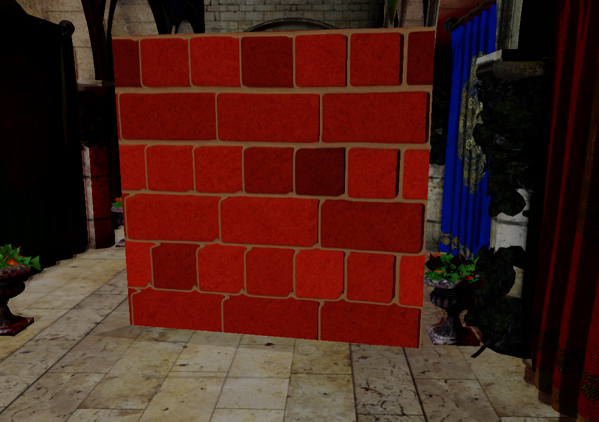
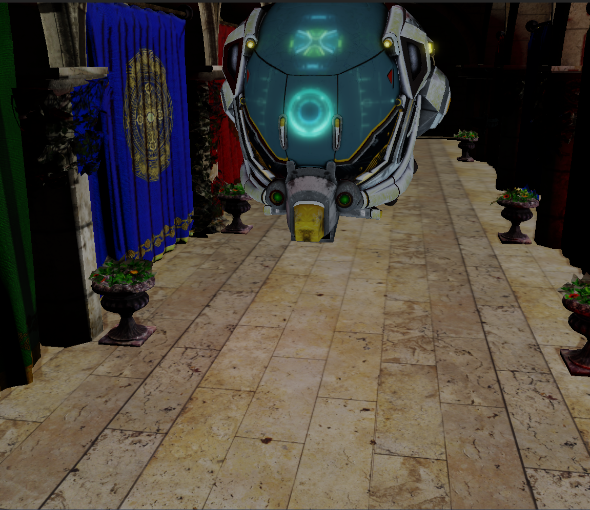

# Ratio rendering library

## Contents

- [Ratio rendering library](#ratio-rendering-library)
  - [Contents](#contents)
  - [Introduction](#introduction)
  - [Supported backends](#supported-backends)
  - [Clone](#clone)
  - [Features](#features)
    - [SSAO](#ssao)
    - [Parallax mapping](#parallax-mapping)
    - [Multi pass bloom](#multi-pass-bloom)
    - [Cascade shadow map](#cascade-shadow-map)
  - [Dependencies](#dependencies)
    - [Windows](#windows)
    - [Generating projects](#generating-projects)
  - [Documentation](#documentation)
  - [Vendor products](#vendor-products)
  - [License](#license)

## Introduction

Raito aims to be a powerful rendering engine designed for creating visually stunning graphics with a particular emphasis on lighting and deferred plus rendering techniques.

## Supported backends

|         | Vulkan | DX12 | OpenGL |
|---------|--------|------| -------|
| Windows | ✘      | ✘   | ✓     |
| Linux   | ✘      | ✘    | ✘    |
| MacOS   | ✘      | ✘    | ✘    |

## Clone

Run ``git clone --recursive https://github.com/ZaroDev/Raito``

If you have problems with the submodules remember to
``git submodule init`` and ``git submodule update --remote``

## Features

### SSAO

| On | Off |
|--------|------|
|  |  | 

### Parallax mapping

| On | Off |
|--------|------|
|  |  | 

### Multi pass bloom

| On | Off |
|--------|------|
|  |  | 

### Cascade shadow map

| On | Off |
|--------|------|
|  |  | 

## Dependencies

### Windows

Must if you want the project to build:

- Visual Studio 2022
- CMake

### Generating projects

Run ``Setup-XXXX.bat``

## Documentation

Documentation is available on [Github pages](https://zarodev.github.io/Raito/)

## Vendor products

- [Dear ImGui](https://github.com/ocornut/imgui)
- [GLFW](https://www.glfw.org)
- [Premake](https://premake.github.io)
- [ImGuizmo](https://github.com/CedricGuillemet/ImGuizmo)
- [Doxygen](https://www.doxygen.nl)

## License

MIT License

Copyright (c) 2023 Víctor Falcón Zaro

Permission is hereby granted, free of charge, to any person obtaining a copy
of this software and associated documentation files (the "Software"), to deal
in the Software without restriction, including without limitation the rights
to use, copy, modify, merge, publish, distribute, sublicense, and/or sell
copies of the Software, and to permit persons to whom the Software is
furnished to do so, subject to the following conditions:

The above copyright notice and this permission notice shall be included in all
copies or substantial portions of the Software.

THE SOFTWARE IS PROVIDED "AS IS", WITHOUT WARRANTY OF ANY KIND, EXPRESS OR
IMPLIED, INCLUDING BUT NOT LIMITED TO THE WARRANTIES OF MERCHANTABILITY,
FITNESS FOR A PARTICULAR PURPOSE AND NONINFRINGEMENT. IN NO EVENT SHALL THE
AUTHORS OR COPYRIGHT HOLDERS BE LIABLE FOR ANY CLAIM, DAMAGES OR OTHER
LIABILITY, WHETHER IN AN ACTION OF CONTRACT, TORT OR OTHERWISE, ARISING FROM,
OUT OF OR IN CONNECTION WITH THE SOFTWARE OR THE USE OR OTHER DEALINGS IN THE
SOFTWARE.
